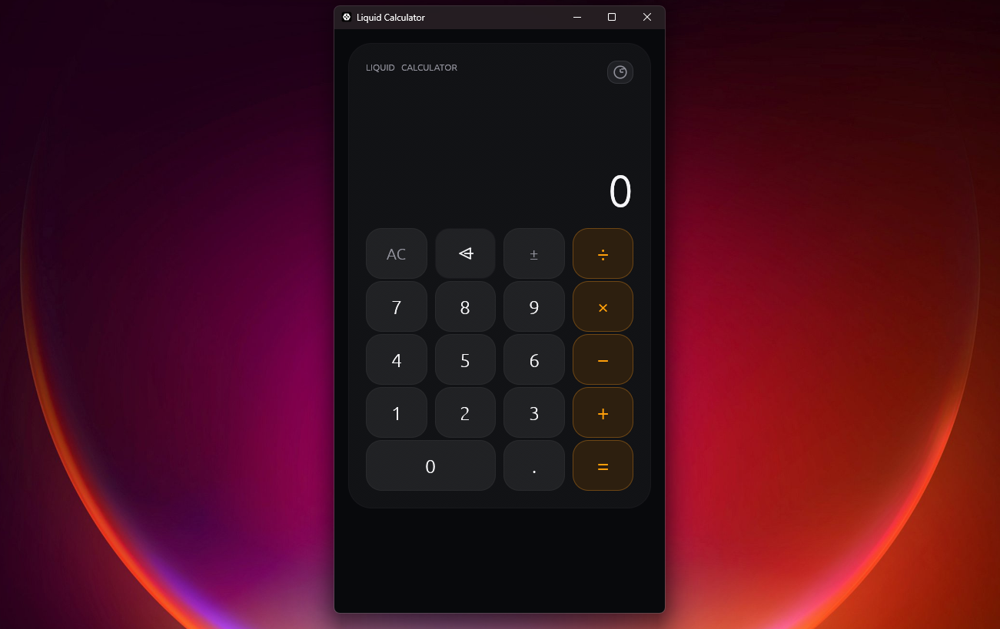

<div align="center">

# 🧮 Liquid Calculator

### Минималистичный калькулятор на Rust • Minimal calculator built with Rust

[]()
[]()
[]()

**Простой. Быстрый. Красивый.** • **Simple. Fast. Beautiful.**

</div>

---

## 📖 О проекте • About

**Русский:**  
Liquid Calculator — это минималистичный десктопный калькулятор, написанный на Rust с использованием `egui` и `eframe`.

Главный акцент проекта — приятный современный интерфейс в стиле **Liquid Glass** с плавными анимациями, подсветкой кнопок и историей вычислений.

**English:**  
Liquid Calculator is a minimal desktop calculator written in Rust using `egui` and `eframe`.

The main focus of the project is a clean modern **Liquid Glass** interface with smooth animations, button feedback, keyboard controls, and calculation history.

---

## 📸 Скриншоты • Screenshots



---

## ✨ Возможности • Features

| 🇷🇺 Русский | 🇬🇧 English |
|-------------|------------|
| 🧮 Базовые арифметические операции | 🧮 Basic arithmetic operations |
| ➕ Сложение и вычитание | ➕ Addition and subtraction |
| ✖️ Умножение | ✖️ Multiplication |
| ➗ Деление | ➗ Division |
| ⌫ Удаление последнего символа | ⌫ Backspace |
| 🔄 Повторное выполнение `=` | 🔄 Repeat `=` operations |
| ⌨️ Управление с клавиатуры | ⌨️ Keyboard controls |
| 📜 История вычислений | 📜 Calculation history |
| 🗑️ Очистка истории | 🗑️ Clear history |
| ✨ Анимации кнопок | ✨ Button animations |
| 🌙 Тёмный интерфейс | 🌙 Dark interface |
| 🪟 Liquid Glass стиль | 🪟 Liquid Glass design |
| 🖥️ Десктопное приложение | 🖥️ Desktop application |

---

## ⌨️ Управление с клавиатуры • Keyboard Controls

| Клавиша | Действие • Action |
|---------|-------------------|
| `0-9` | Ввод цифр • Enter numbers |
| `+` | Сложение • Addition |
| `-` | Вычитание • Subtraction |
| `*` | Умножение • Multiplication |
| `/` | Деление • Division |
| `.` | Десятичная точка • Decimal point |
| `Enter` / `=` | Вычислить • Calculate |
| `Backspace` | Удалить символ • Delete character |
| `Esc` / `Delete` / `C` | Очистить • Clear |

---

## 🛠️ Технологии • Tech Stack

<div align="center">

| Технология | Для чего • Purpose |
|------------|-------------------|
| **Rust** | Основной язык • Main language |
| **eframe** | Оконное приложение • Application framework |
| **egui** | GUI и интерфейс • GUI framework |
| **Cargo** | Сборка и зависимости • Build system & package manager |

</div>

---

## 📦 Установка • Installation

### 🇷🇺 Windows

Убедись, что установлен Rust и Cargo.

```powershell
# Клонируй репозиторий • Clone the repository
git clone https://github.com/kiru0real/LiquidCalculator.git

# Перейди в папку • Go to the project folder
cd LiquidCalculator

# Запусти приложение • Run the application
cargo run
